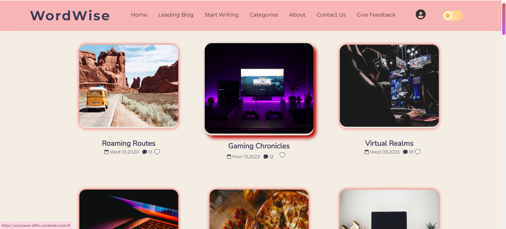
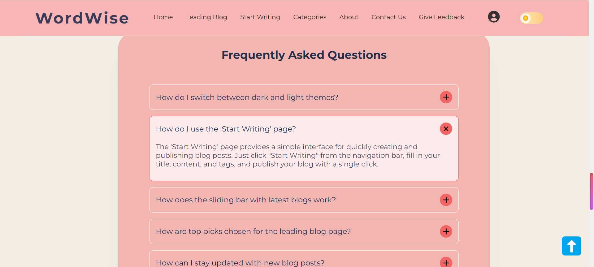

# 📖 WordWise Blogging Website 📝 
**WordWise** is a responsive, user-friendly blogging platform designed to enrich vocabulary and engage readers with insightful articles. Built using **HTML**, **CSS**, and **JavaScript**, the website offers an enjoyable experience with an interactive interface. Whether you're here to read blogs or explore topics, WordWise is for everyone.

---

<table align="center">
    <thead align="center">
        <tr border: 1px;>
            <td><b>🌟 Stars</b></td>
            <td><b>🍴 Forks</b></td>
            <td><b>🐛 Issues</b></td>
            <td><b>🔔 Open PRs</b></td>
            <td><b>🔕 Close PRs</b></td>
        </tr>
     </thead>
    <tbody>
         <tr>
            <td></td>
            <td></td>
            <td></td>
            <td></td>
           <td></td>
        </tr>
    </tbody>
</table>
</div>

---

## Featured In

<table>

   <tr>
      <th>Event Logo</th>
      <th>Event Name</th>
      <th>Event Description</th>
   </tr>
   <tr>
      <td></td>
      <td>GirlScript Summer of Code 2024</td>
      <td>GirlScript Summer of Code is a three-month-long Open Source Program conducted every summer by GirlScript Foundation. It is an initiative to bring more beginners to Open-Source Software Development.</td>
   </tr>
</table>

---
## 🌟 Table of Contents
- [Key Features](#-key-features-)
- [Technologies Used](#-technologies-used-)
- [How to Contribute](#-how-to-contribute-to-this-project-)
- [Contribution](#contribution)
- [Code of conduct](#code-of-conduct)
- [Contribution Points](#contribution-points)
- [GSSoC Guidelines](#gssoc-guidelines)
- [Ending Note](#-ending-note-)
- [Join Us!](#-join-us-)
- [Contributors](#our-valuable-contributors-️)
- [Website Preview](#-website-preview)
- [Stargazers](#stargazers)
- [Forkers](#forkers)
---

## ✨ Key Features ✨
- **📱 Responsive Design**
  - Thoughtful layout with sections like Home, Leading Blogs, About, and Contact Us for a dedicated navigation experience.

- **📝 Blog Functionality**
  - Category exploration for easier navigation through organized blogs.
  - User Interface designed with appealing graphics to engage viewers.

- **⭐ User Engagement**
  - Readers can share their thoughts and feedback directly on the Contact Us page.

---

## ⚙️ Technologies Used ⚙️
1. **🟦 HTML (HyperText Markup Language)**
   - Provides structure to the website, organizing content into various elements such as headings, paragraphs, buttons, and images.

2. **🟪 CSS (Cascading Style Sheets)**
   - Responsible for the aesthetics, enhancing visual appeal, and ensuring responsiveness across all devices.

3. **⬛ JavaScript**
   - Adds interactivity and dynamic features, enriching user engagement through blog navigation, comment sections, and form validations.

---

## 🚀 How to Contribute to This Project

We’re excited to have you contribute to the **WordWise Blogging Website** project! Follow these simple steps to get started:

1. **🍴 Fork the Repository**  
   - Go to the [repository page](https://github.com/ANSHIKA-26/WordWise).
   - Click the *Fork* button (top right) to create a copy in your GitHub account.

2. **💻 Clone Your Fork**  
   - Open your terminal and run:
     ```bash
     git clone https://github.com/your-username/WordWise.git
     ```
   - Replace `your-username` with your GitHub username.

3. **🌿 Create a New Branch** 
   - Create a new branch for your work:
     ```bash
     git checkout -b your-branch-name
     ```

4. **🛠️ Make Your Changes**
   - Open the project files in your code editor and make your changes.
   - Contact the project manager [ANSHIKA](https://github.com/ANSHIKA-26) for any queries.

5. **✅ Test Your Changes**
   - Test your changes locally by opening the `index.html` file in your browser.

6. **💬 Commit Your Changes** 
   - Once ready, commit them with a descriptive message:
     ```bash
     git add .
     git commit -m "Added feature X or Fixed issue Y"
     ```

7. **📤 Push Your Changes**
   - Push your changes to your forked repository:
     ```bash
     git push origin your-branch-name
     ```

8. **🔄 Create a Pull Request (PR)** 
   - Go back to the original repository [here](https://github.com/ANSHIKA-26/WordWise).
   - Click the *Compare & pull request* button, write a short description of your changes, and submit the PR.

9. **🔎 Review Changes**
   - The project manager will review your PR, and if approved, your request will be merged.

---
 ## Usage
- Open the website and navigate through the articles.
- Use the search bar to find specific topics.
- Click on any article to read in detail.

---
##  Contribution

Contributions are what make the open-source community such an amazing place to learn, inspire, and create. Any contributions you make are **greatly appreciated**.

- If you have any suggestions for the project, such as reporting a bug, improving the UI, or enhancing the README.md file, feel free to **open an issue** to discuss it or directly create a pull request with the necessary changes.
- Please make sure to check your spelling and grammar.
- Create individual pull requests for each suggestion to keep changes focused and manageable.

Your involvement helps to improve the project and make it better for everyone. Thank you for your contributions!

Kindly go through [CONTRIBUTING.md](CONTRIBUTING.md) to understand everything from setup to contributing guidelines.

If you would like to contribute to the project, please follow our contribution guidelines.

---
## <h2> Code of Conduct</h2>

We are committed to fostering a welcoming and inclusive environment for everyone. All contributors and participants are expected to uphold the following values:

- Be respectful of different viewpoints and experiences.
- Show empathy toward others.
- Use inclusive language.

Please read and follow our [Code of Conduct](CODE_OF_CONDUCT.md) to foster an inclusive community.
If anyone violates these standards, they may be banned from the community.

---

## 🏆 Contribution Points
All tasks will be assigned various levels based on complexity and required skills. Each level provides different points:
- **🥇 Level 1**: 10 Points  
- **🥈 Level 2**: 25 Points  
- **🥉 Level 3**: 45 Points  

---

## GSSoC Guidelines 
It is important to adhere to the guidelines; violations can affect your profile. Review the guidelines [here](https://github.com/GSSoC24/Contributor/tree/main/gssoc-guidelines).

---


## 📄 Ending Note
Thank you for checking out the WordWise Blogging Website! We hope you find this project enjoyable and informative. Your feedback, contributions, and suggestions are always welcome!

If you have any questions or need assistance, please feel free to reach out through the Issues section of this repository.

---

## 🙌🏻 Join Us!
We encourage you to explore the website, share your thoughts, and get involved in improving the project. Let’s make this blogging experience even better together!

---

## Our Valuable Contributors ❤️✨

[](https://github.com/say-het/WordWise/graphs/contributors)

---

## 📸 Website Preview



🌐 **Visit our website:** [WordWise](https://wordwise-k9ho.onrender.com/#)

---
## Stargazers

<div align='center'>

[](https://github.com/ANSHIKA-26/WordWise/stargazers)

</div>

---
## Forkers
<div align='center'>

[](https://github.com/ANSHIKA-26/WordWise/network/members)

</div>
---

<div align="center">
    <a href="#top">
        
    </a>
</div>

## Show some ❤️ by starring this awesome repository!